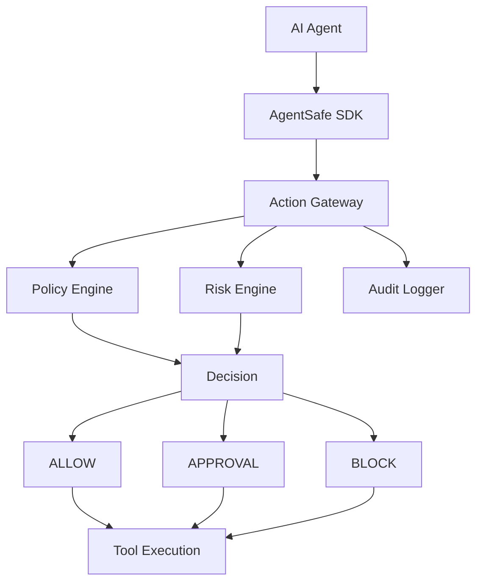

# AgentSafe

AgentSafe is a developer-first runtime security layer for AI agents. It evaluates actions before execution, computes a deterministic risk score, checks policy rules, and decides whether to allow, block, or require approval.

## What is AgentSafe?

AgentSafe sits between an AI agent and its tools. It inspects the tool name, arguments, environment, and metadata before execution. The service then evaluates the risk using a deterministic rules engine and enforces policy decisions.

## Architecture



## Features

- Deterministic risk scoring for tool calls
- Policy allow/deny/approval logic
- Audit logging with secret redaction
- Human approval workflow
- SDK and decorator APIs
- Simulated demo environment for local development
- Dashboard and API endpoints

## Installation

### Option A: Run locally without Docker

```powershell
cd backend
python -m venv .venv
.\.venv\Scripts\Activate.ps1
pip install -r requirements.txt
python -m uvicorn app.main:app --reload --port 8000
```

In a second terminal:

```powershell
cd frontend
npm install
npm run dev
```

Open:
- Frontend: http://localhost:5173
- Backend: http://localhost:8000
- Swagger: http://localhost:8000/docs

### Option B: Run with Docker Compose

```powershell
docker compose up --build
```

## Windows setup

Use PowerShell commands when working on Windows. Example:

```powershell
cd backend
python -m venv .venv
.\.venv\Scripts\Activate.ps1
pip install -r requirements.txt
python -m uvicorn app.main:app --reload --port 8000
```

## SDK usage

```python
from agentsafe_sdk import AgentSafe

guard = AgentSafe(api_url="http://localhost:8000")

result = guard.check_action(
    agent="support-agent",
    tool="database.delete_user",
    arguments={"user_id": "123"},
    environment="production",
)

if result.blocked:
    print(result.reason)
else:
    print("Action permitted")
```

## Example

```python
from agentsafe_sdk import AgentSafe

guard = AgentSafe(api_url="http://localhost:8000")

@guard.protect(tool="database.delete_user")
def delete_user(user_id):
    return {"status": "deleted", "user_id": user_id}
```

## API documentation

The API is served with FastAPI docs at:

- http://localhost:8000/docs
- http://localhost:8000/redoc

## Testing

```powershell
cd backend
.\.venv\Scripts\Activate.ps1
pytest -q
```

Frontend build:

```powershell
cd frontend
npm run build
```

## Security model

AgentSafe uses a deterministic local rules engine as the source of truth. If `LLM_ENABLED=true` and an OpenAI key exists, the LLM can enhance explanations and suggestions, but the final decision still relies on the deterministic engine.

## Contributing

This project is open to community contributions. Anyone can open issues or pull requests, but merge approval remains with the project maintainer.

- See [CONTRIBUTING.md](CONTRIBUTING.md) for contribution rules
- See [.github/pull_request_template.md](.github/pull_request_template.md) for PR guidance
- See [.github/CODEOWNERS](.github/CODEOWNERS) for maintainer ownership

## Limitations

This MVP intentionally focuses on local runtime protection and developer workflow. It does not attempt full enterprise IAM, SIEM, Kubernetes security, or distributed multi-service controls.

## Roadmap

- richer policy templates
- rule import/export
- more tool adapters
- approval UI improvements
- optional SaaS control plane

## License

MIT
